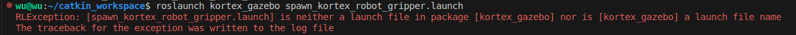

# ros-quick-runner README

这是一个为 ROS（机器人操作系统）开发者设计的 VSCode 扩展，旨在快速启动 `.launch` 或者 `.cpp` 或者 `.py` 文件。

通过简单的右键菜单操作或快捷键，你可以直接在 VSCode 中运行 ROS 的 `roslaunch` 或者 `rosrun` 命令。
<div align=center>
    
</div>

## 功能

- **快速启动 `.launch`/`.cpp`/`.py` 文件**：通过右键点击 `.launch`/`.cpp`/`.py` 文件，直接启动 ROS 的 `roslaunch` / `rosrun` 命令。
- **自动解析 ROS 包名**：扩展会自动解析 `.launch`/`.cpp`/`.py` 文件所在的 ROS 包名，无需手动输入。
- **智能路径解析**：支持从 `.launch`/`.cpp`/`.py` 文件路径中自动查找 `package.xml` 文件，以确保正确获取 ROS 包名。

## 安装

1. 打开 VSCode。
2. 进入扩展商店（`Ctrl+Shift+X` 或 `Cmd+Shift+X`）。
3. 搜索 `ros-quick-runner` 并安装。
4. 重启 VSCode 以确保扩展正常加载。

## 使用方法

演示视频如下：

[视频](./pic/result.gif)


使用前说明（非常重要）：

1. 确保你的 ROS 环境已经正确安装并配置。
2. 由于插件是调用的vscode中的终端，请确定好你的环境，如果你使用的是linux自带的python 环境，请在.bashrc中关闭你的conda环境。否则就会出现错误。

3. 确保你的.bashrc中存在类似一下的命令。
    ```bash
    source ~/catkin_ws/devel/setup.bash
    ```
    否则，可能会出现如下错误：
    


### 通过右键菜单启动 `.launch` 文件
1. 在 VSCode 的资源管理器中找到你的 `.launch` 文件。
2. 右键点击文件，选择 `ROSLaunch`。
3. 扩展会自动解析包名并运行 `roslaunch` 命令。

### 通过右键菜单启动 `.cpp`/`.py` 文件
1. 在 VSCode 的资源管理器中找到你的 `.cpp`/`.py` 文件。
2. 右键点击文件，选择 `ROSRun`。
3. 扩展会自动解析包名并运行 `rosrun` 命令。


## 扩展设置

本扩展目前没有提供额外的 VSCode 设置。所有功能默认启用。

## 已知问题

- 如果 `.launch`/`.cpp`/`.py` 文件不在 ROS 包目录下，扩展可能无法正确解析包名。
- 如果 `package.xml` 文件不存在或路径不正确，扩展将无法找到 ROS 包名。

## 发行说明

### 1.0.0
- 初始版本发布。
- 支持`.launch` 文件的快速启动。
- 支持`.cpp`和`.py`文件的快速启动。

### 1.0.1
- 添加了logo。

### 1.0.2
- 添加了演示视频

**祝你使用愉快！**
